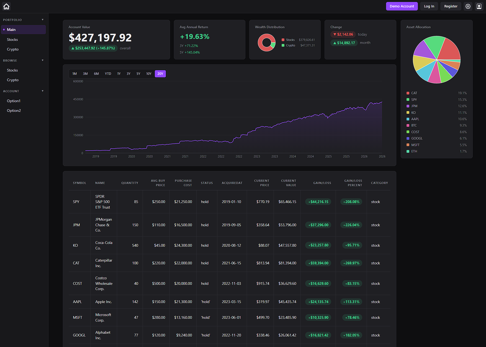
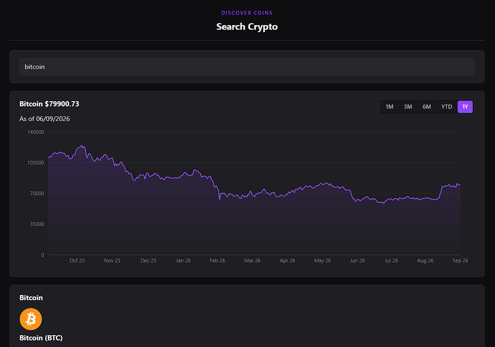
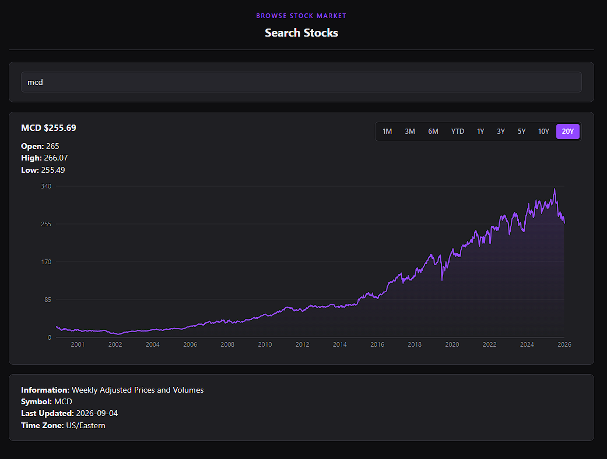
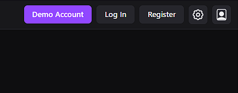
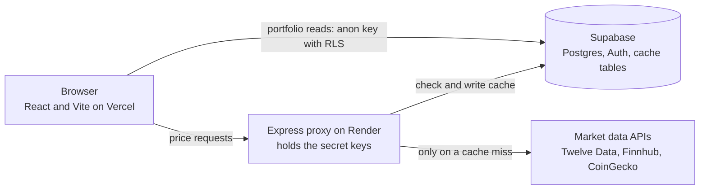

<h1 align="center">Net Worth Tracker</h1>

<p align="center">
  One clear picture of everything you own: stocks, crypto, and real estate.
</p>

<p align="center">
  <a href="https://tracker-app-tau-blue.vercel.app/"><strong>Open the live demo »</strong></a>
</p>

<p align="center">
  <a href="https://tracker-app-tau-blue.vercel.app/"></a>
  
  
  
  
  
  
  
</p>

<p align="center">
  
</p>

## What it is

A full stack net worth tracker I built to learn how a real app fits together. It pulls your holdings into one place, stocks, crypto, real estate, and answers the plain questions: what am I worth, how has that changed, and where is it all sitting?

It's not a trading app. It's more of a big picture dashboard, the kind of thing you'd glance at once a week rather than a screen you'd day trade on. I put it online with a demo account so anyone can click around without signing up.

## Give it a spin

> **Just want to look?** Open the [live demo](https://tracker-app-tau-blue.vercel.app/), click **Demo Account** in the top bar, and you're in. No signup.

That loads a full, populated portfolio. From there, head to **Portfolio → Main** for the dashboard in the screenshot above.

You can also skip the account and use **Browse** to look up any stock or coin. Quick heads up: crypto search is fully live, and stock search leans on symbols that are already cached, so if one comes up empty, try a big name like AAPL.

## Features

- One net worth number across everything: stocks, crypto, and real estate, with custom assets on the list.
- Overall return, plus a rough average annual return projected out 3 and 5 years.
- A net worth chart over time, anywhere from one month back to twenty years.
- Allocation at a glance, both by category and by individual holding.
- A holdings table with current price, current value, and gain or loss per position, green for up and red for down.
- Browse any stock or coin for a price chart and the key facts, no account needed.
- Each person only ever sees their own data, enforced by the database itself.

<table>
  <tr>
    <td width="33%" valign="top"><br><sub><b>Browse crypto.</b> Search a coin, get its chart and details.</sub><br></td>
    <td width="33%" valign="top"><sub><b>Browse stocks.</b> Price history with range buttons.</sub><br></td>
    <td width="33%" valign="top"><sub><b>Demo account.</b> One click in, no signup.</sub><br></td>
  </tr>
</table>

## Tech stack

**Frontend**
- React 19 with TypeScript
- Vite
- React Router
- Recharts for the price and net worth charts
- Supabase client for auth and data

**Backend**
- Node with Express 5
- TypeScript, run with tsx (no build step)

**Data and infrastructure**
- Supabase: Postgres, Auth, and row level security
- Market data from Twelve Data and Finnhub (stocks) and CoinGecko (crypto)
- Frontend on Vercel, backend on Render

## Architecture

The same idea repeats for every asset class: **proxy, cache, display.**



- The browser holds only the public Supabase key and never calls a market API directly.
- A small Express proxy holds every secret key. It fetches prices and caches each response in Postgres with a freshness window, so a repeat lookup skips the external call and the app stays fast.
- Portfolio data is read straight from Supabase. Row level security filters rows on the server, so a query with no user filter still comes back with only the logged in user's data.
- Auth is a Supabase session: the token lives in the browser and the database checks it on every query.

It's hosted on Vercel (frontend) and Render (backend), with a small uptime ping so the free backend does not doze off. The full diagram, schema, and decision log live in the [docs](docs/) folder.

## Under the hood

A few bits I'm a little proud of, and a few I'm still figuring out.

- **Secrets stay on the server.** The proxy exists for one reason: to keep every market data key off the browser. The browser only ever carries the public Supabase key, which is safe to expose.
- **The database decides who sees what.** With row level security, the portfolio query runs `select('*')` with no filter and still gets back only the current user's rows. Postgres rewrites the query to match the session before any data leaves. I like that the safety is built in rather than something I have to remember to add.
- **Caching that gets cheaper the more it's used.** Every external response is cached in Postgres with its own freshness window, since a catalog barely changes and a price changes constantly. A repeat lookup never touches the API, and each new search warms the cache for the next person.
- **It doesn't fall over when an API says no.** When a live stock fetch gets rejected, the route hands back the last good cached value marked stale instead of throwing an error, so the page keeps working.
- **The net worth line is stitched together by hand.** There's no stored history yet, so the chart gets built on the fly. I line up each holding's weekly prices on a shared date grid, weight them by quantity, and trim to the start they all share. That leaves one line for the whole portfolio over time.
- **Typed front to back.** TypeScript across the frontend and backend, with a written schema and a decisions log kept next to the code.
- **A few different market data APIs.** I ended up using three (Twelve Data, Finnhub, CoinGecko). Partly they each suit a slightly different job, partly I just wanted to try them out and see how they compare.

## Project structure

Two separate Node projects in one repo: the React app at the root, the Express proxy under `backend/`. Just the folders that matter, not every file.

```
tracker-app/
├─ src/                     React and TypeScript frontend
│  ├─ context/              auth session state (AuthContext)
│  ├─ hooks/                data fetching: proxy routes and Supabase
│  ├─ utils/                extract, transform, format, portfolio math
│  └─ components/
│     ├─ topBar/  leftMenu/  ui/
│     └─ mainContent/
│        ├─ browse/         stock and crypto search with charts
│        └─ portfolio/      net worth overview and holdings tables
├─ backend/                 Express proxy (its own package.json and deps)
│  ├─ routes/               stocks, crypto, catalog
│  └─ server.ts             entry point and route wiring
├─ docs/                    architecture, schema, decisions, tools
└─ vercel.json              routing rules for the live deploy
```

## Getting started

Want to run it yourself? It's two separate projects, and each one has its own `.env`. You'll need your own Supabase project and free tier API keys. The live demo needs none of that.

**Prerequisites**
- Node.js 20 or newer
- A Supabase project (free tier is fine), with the tables from [docs/SCHEMA.md](docs/SCHEMA.md)
- API keys for Twelve Data, Finnhub, and CoinGecko

**1. Frontend** (from the repo root)

```bash
npm install
cp .env.example .env    # then fill in the values
npm run dev             # http://localhost:5173
```

**2. Backend**

```bash
cd backend
npm install
cp .env.example .env    # then fill in the values
npm run dev             # http://localhost:3001
```

The frontend `.env` holds only the public Supabase URL and key. Every secret key stays in the backend `.env` and never reaches the browser. Both `.env.example` files list exactly what to fill in.

## Docs

I wrote down the reasoning behind the build too, in four short docs.

- [Architecture](docs/ARCHITECTURE.md): system diagram, layout, security model, routes
- [Schema](docs/SCHEMA.md): every table, column, constraint, and RLS rule
- [Decisions](docs/DECISIONS.md): the log of choices and the trade offs behind them
- [Tools](docs/TOOLS.md): the external services and libraries, and what each is for

---

<p align="center"><sub>Built to learn, and still a work in progress. Poke around the code and take whatever's useful.</sub></p>
